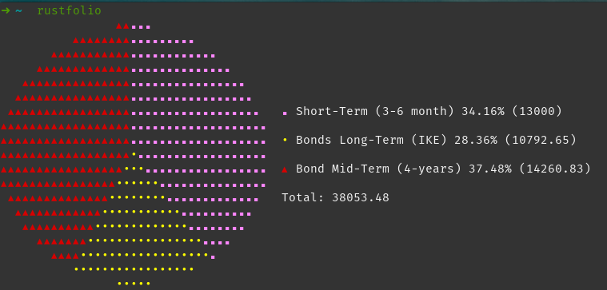

# Rustfolio

Rustfolio is a program for monitoring your investment portfolio. It's main purpose is to show a summary of all your assets and their share in the entire portfolio. The portfolio data is stored in a `.csv` file, so it can be imported into any spreadsheet processor like Libre Office Calc or Microsoft Exel for more complicated processing and analisys.



## Example usage

### Show the portfolio "MyPortfolio"

```sh
rustfolio --file MyPortfolio
```

`--file` flag can be omitted. In this case the program will promt to select the portfolio that exists.

### Modify a portfolio

```sh
rustfolio --update --file MyPortfolio
```

The program will promt you to provide data for each asset category in the portfolio and will save it in the specified file. If `--file` is omitted, it will promt to select a portfolio. If none exists, it will promt to create a new one.
