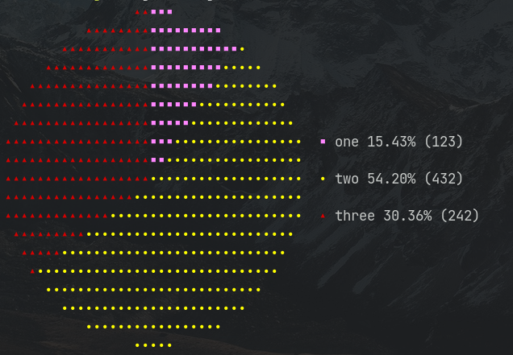

# Rustfolio

Rustfolio is a program for monitoring your investment portfolio. It's main purpose is to show a summary of all your assets and their share in the entire portfolio. The portfolio data is stored in a `.csv` file, so it can be imported into any spreadsheet processor like Libre Office Calc or Microsoft Exel for more complicated processing and analisys. The files are stored in `~/.local/share/rustfolio` directory.


## Installation

### With Cargo

[Install](https://www.rust-lang.org/tools/install) Cargo and Rust: .rust-lang.org/tools/install. Once Cargo is in your $PATH, run

```sh
cargo install rustfolio
```

### From binary

Grab the latest binary for your platform on Github [releases](https://github.com/Melesar/rustfolio/releases) page. Put the binary somewhere in your $PATH. Run `rustfolio -V` to make sure it is installed properly.

## Example usage

### Show the portfolio "MyPortfolio"

```sh
rustfolio --file MyPortfolio
```

`--file` flag can be omitted. In this case the program will promt to select the portfolio that exists.
To see the entire history of the portfolio instead of the latest entry, add `--table` flag

```sh
rustfolio --file MyPortfolio --table
```

### Create a new portfolio

```sh
rustfolio new MyPortfolio
```

If the portfolio name is not specified, the program will ask you to enter it. There is also an option to read the name from `stdin`. To do that, add `--read-name` flag and leave the argument empty.

### Modify a portfolio

```sh
rustfolio add --file MyPortfolio
```

The program will promt you to provide data for each asset category in the portfolio and will save it in the specified file. If `--file` is omitted, it will promt to select an existing portfolio. If none exists, it will promt to create a new one.

Every time you `add` to an existing portfolio, this data will be added to the portfolio .csv file with the current date and time. This way, you will have a history of your portfolio

### List available portfolios

```sh
rustfolio list
```

### Export a portfolio as a .csv file

```sh
rustfolio export -o output.csv --file MyPortfolio
```

Flag `--file` can be omitted. In this case you will be promted to select one of the available portfolios

## Usage in scripting

Rustfolio allows to use all above commands in non-interactive move using pipes and stream redirections. For example, suppose that there is a file `input.txt` with a following content:

```
one
123
two
432
three
242
```

Than `cat input.txt | rustfolio new MyPortfolio` will generate the following portfolio:



The same effect can be achieved with `--read-name` flag. In this case the `input.txt` must look as following:

```
MyPortfolio
one
123
two
432
three
242
```

And the command will be: `cat input.txt | rustfolio new --read-name`

## License

The project is licensed under MIT license. See [LICENSE](https://github.com/Melesar/rustfolio/blob/development/LICENSE) file for details.
